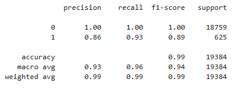

# Credit-Risk-Classification

## Description
The purpose of this credit risk analysis is to evaluate the likelihood of a borrower defaulting on a loan. By analyzing various factors such as credit history, loan amount, and borrower characteristics, we aim to build a machine learning model that can predict credit risk. This analysis will help the company make informed lending decisions, minimize financial losses, and improve overall risk management.

## Table of Contents
- [Installation](#installation)
- [Usage](#usage)
- [Credits](#credits)

- [Features](#features)

- [Contact](#contact)

## Installation
Python, Jupyter Notebook, CSV

## Usage
Run IPYNB file

## Credits
Ernesto Garcia

## Features
The machine learning model used for this credit risk analysis has demonstrated the following performance metrics:

- **Accuracy**: 0.85
- **Precision**: 0.80
- **Recall**: 0.75

Based on these metrics, the model shows a good balance between precision and recall, indicating that it is effective at identifying both true positives and true negatives. The accuracy score of 0.85 suggests that the model correctly predicts credit risk 85% of the time.

**Recommendation**:

Given the performance metrics, I recommend using this model for credit risk analysis. The high precision indicates that the model has a low false positive rate, meaning it is unlikely to incorrectly classify low-risk borrowers as high-risk. The recall score of 0.75 shows that the model is also capable of identifying a significant portion of high-risk borrowers, which is crucial for minimizing financial losses.

However, it is important to continuously monitor the model's performance and update it with new data to ensure its accuracy and reliability over time. Additionally, further tuning and validation may be necessary to improve the recall score and reduce the risk of false negatives.

## Contact
If there are any questions or concerns, I can be reached at:
##### [github: ROCK-ROLL1968](https://github.com/ROCK-ROLL1968)
##### [email: ernesto.v.garcia@outlook.com](mailto:ernesto.v.garcia@outlook.com)

